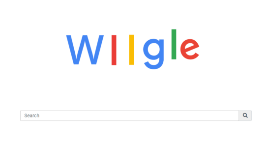
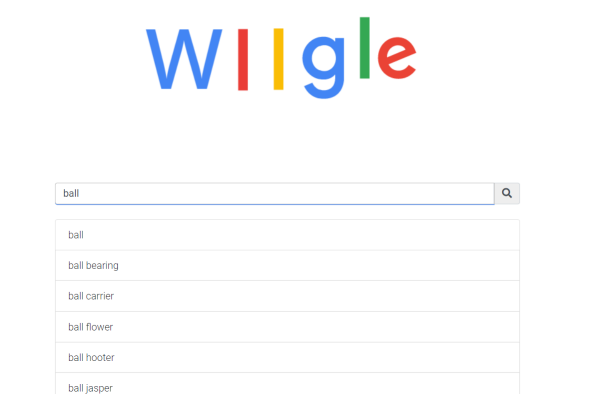

# wiigle-search
 <!-- .element height="20%" width="20%" -->

## Overview
Wiigle (will + google) is a search infrastructure that resembles google, written in C# on Microsoft Azure Cloud Services.
The project is deployed with one web role and one worker role, which serves as the front-end and the back-end of the application, respectively. The front-end of the application implements a search suggestion feature, which displays suggestions to users based on the input. The back-end compoent is served by a web-crawler that crawls web pages in cnn.com

## Search Suggestions

 <!-- .element height="40%" width="40%" -->

With the implementation of trie data structure, the first ten english words that share the same prefix as the input keyword is retrieved on every key press by the user.

## Search Results
 <!-- .element height="30%" width="30%" -->

The crawled pages are stored in Azure Cloud Table, which its titles and urls are retrieved when a keyword is searched by the user. The retrieved results link to the url of the article

